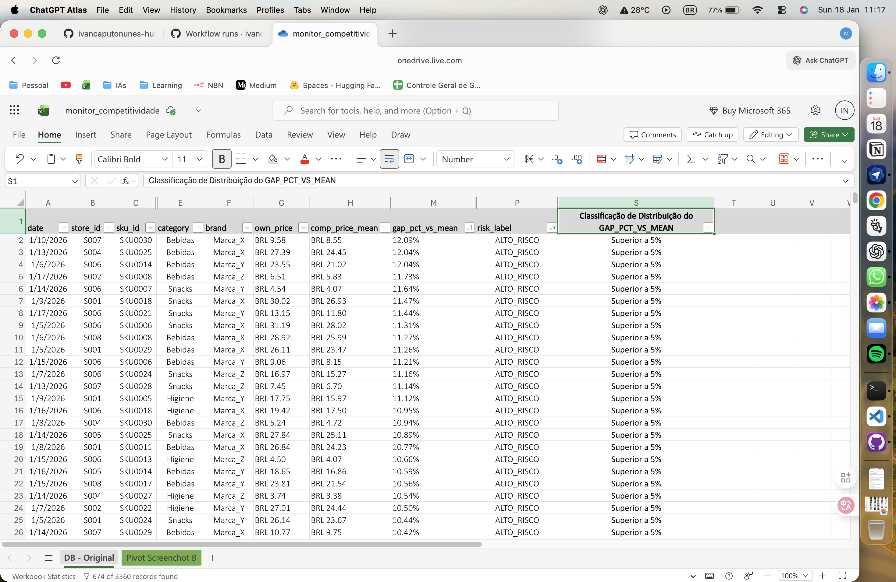
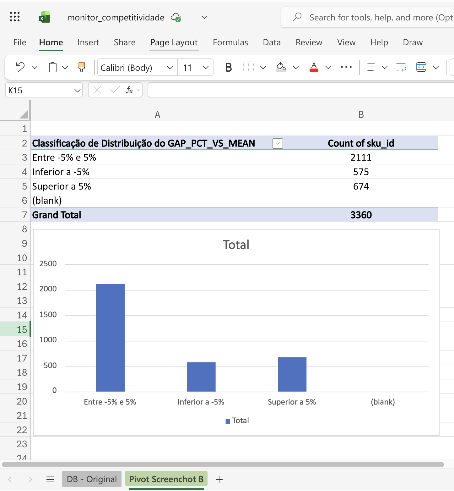

# Monitor de Competitividade e Price Gap
Este projeto não busca definir preços ótimos, mas estruturar critérios claros para tomada de decisão em cenários reais de incerteza.

Logo, estruturei um sistema analítico para **monitoramento competitivo de preços**, identificação de **price gaps**, **dispersões** e **riscos competitivos**, com foco em decisões de pricing no varejo.

O projeto simula um cenário real de negócio, comparando preços próprios vs. concorrência e gerando métricas acionáveis para apoio à tomada de decisão.

---
### Para quem é este projeto?
	•	Para profissionais de pricing, RGM e performance
	•	Para contextos de varejo competitivo
	•	Para apoio tático, não precificação automática

---
### Objetivo de Negócio

Apoiar decisões reais de pricing, reduzindo risco competitivo e priorizando ações com impacto financeiro.

Permite responder perguntas como:
- Estou acima ou abaixo do mercado?
- Onde o gap de preço é relevante?
- Quais itens estão em **alto risco competitivo**?
- O mercado está estável ou disperso?

---

### Arquitetura do Projeto

Arquitetura pensada para separar **orquestração**, **lógica de negócio** e **dados**, seguindo boas práticas de engenharia de dados.
```monitor-competitividade-price-gap/
├── data/
│   ├── raw/            # Dados de entrada (preços próprios e concorrência)
│   └── processed/      # Dados tratados (parquet)
├── outputs/            # Outputs finais (CSV para consumo de negócio)
├── scripts/            # Orquestração do pipeline
│   ├── generate_sample_data.py
│   └── run_pipeline.py
├── src/price_gap_monitor/
│   ├── pipeline.py     # Lógica principal de competitividade e pricing
│   ├── metrics.py      # Cálculo de métricas de gap e dispersão
│   ├── risk.py         # Classificação de risco competitivo
│   └── io.py           # Leitura e escrita de dados
├── tests/              # Testes unitários
├── pyproject.toml      # Configuração do pacote Python
└── README.md
```

**Por que essa arquitetura**
- Separação clara entre **orquestração** e **regras de negócio**
- Projeto instalável como **pacote Python**
- Facilita testes, manutenção e escala
- Padrão usado em ambientes profissionais de dados

---

### Fluxo de Dados

1. Dados brutos entram em `data/raw`
2. Pipeline calcula métricas de competitividade e risco
3. Dados tratados são salvos em `data/processed` (parquet)
4. Output final é exportado em `outputs/monitor_competitividade.csv`

---

## Como Executar o Projeto

Este projeto simula um pipeline de análise de competitividade e price gap com foco em apoiar decisões de pricing e RGM.

### Pré-requisitos
- Python 3.11 ou superior
- Git

### Instalação
Clone o repositório e acesse a pasta do projeto:
```bash
git clone https://github.com/ivancaputonunes-hub/monitor-competitividade-price-gap-py.git
cd monitor-competitividade-price-gap-py

```
### Crie um ambiente virtual:
```bash
python -m venv .venv
```

### Ative o ambiente virtual:
```bash
# macOS / Linux
source .venv/bin/activate

# Windows (PowerShell)
.\.venv\Scripts\Activate.ps1
```

### Instale as dependências:
```bash
pip install -r requirements.txt
```

### Caso o projeto esteja configurado como pacote:
```bash
pip install -e .
```

---
### Gerar base de exemplo (opcional, recomendado para primeira execução)
Gera um conjunto de dados sintético para simular cenário de negócio:
```bash
python scripts/generate_sample_data.py
```

---

### Quickstart (copiar e colar)
Roda o pipeline e gera os artefatos finais:
```bash
python scripts/run_pipeline.py
```

### Onde saem os arquivos
	•	Dados tratados (parquet): data/processed/
	•	Output final para consumo (CSV): outputs/monitor_competitividade.csv

---

### Testes

Para executar os testes automatizados:
```bash
pytest -q
```
---
### Decision Playbook (RGM)

Este playbook traduz os outputs do monitor em ações táticas.

### Regra 1 — Quando mexer no preço (reduzir)

Mexer quando houver risco competitivo alto e gap acima do mercado.

Critério prático:
	•	gap_pct_vs_mean > +5%
	•	risk_label = HIGH

Ação:
	•	Reduzir preço ou acionar mecanismo de proteção (ex.: ajuste tático por cluster/canal/categoria)

### Regra 2 — Quando segurar

Segurar quando estiver alinhado ao mercado e o risco estiver controlado.

Critério prático:
	•	gap_pct_vs_mean entre -5% e +5%
	•	risk_label = LOW ou MEDIUM

Ação:
	•	Manter preço e monitorar (sem mexer por ansiedade)

### Regra 3 — Quando investigar antes de agir

Investigar quando o gap for negativo (abaixo do mercado), porque pode ser perda de margem sem necessidade.

Critério prático:
	•	gap_pct_vs_mean < -5%

Ação:
	•	Validar competitividade real (cesta, elasticidade, promo, ruptura)
	•	Se não houver justificativa, corrigir para recuperar margem

### Exemplos (com números do output)

Exemplo A — Alto risco competitivo (ação imediata)
	•	own_price: 10.49
	•	comp_price_mean: 9.79
	•	gap_pct_vs_mean: +7.1%
	•	risk_label: HIGH
Decisão: priorizar revisão de preço (ou proteção por cluster) e acompanhar impacto.

Exemplo B — Potencial perda de margem (investigar)
	•	own_price: 8.99
	•	comp_price_mean: 9.79
	•	gap_pct_vs_mean: -8.2%
	•	risk_label: LOW/MEDIUM
Decisão: investigar se há motivo (promo, estratégia, elasticidade). Se não houver, corrigir para recuperar margem.

---

### Premissas e limitações
	•	Concorrência é tratada como comparável (não considera diferenças finas de canal/serviço/experiência)
	•	Gap é calculado de forma estática (não modela elasticidade-preço)
	•	Não incorpora efeito de promoções, ruptura e substitutos de forma explícita
	•	Dispersão captura variabilidade de preço, mas não explica causalidade (ex.: guerra de preços local)


---

### Exemplos de Outputs e Análises

Esta seção demonstra, na prática, os outputs gerados pelo pipeline e como eles suportam decisões reais de pricing e competitividade.


### Output final do pipeline (CSV processado)

Arquivo gerado automaticamente pelo pipeline (`monitor_competitividade.csv`), contendo métricas de competitividade por SKU, loja e data.

Principais campos:
- `own_price`
- `comp_price_mean`
- `gap_pct_vs_mean`
- `risk_label`

Em um ambiente real, este output seria consumido por times de pricing, comercial ou BI como insumo para priorização de ações.
Este arquivo é a base para análises exploratórias, dashboards e priorização de ações de pricing.




### Distribuição de GAP percentual vs mercado (Pivot)

Análise agregada via tabela dinâmica, classificando SKUs conforme o **GAP percentual vs média da concorrência**:

- **Entre -5% e +5%** → Zona neutra / alinhado ao mercado  
- **Inferior a -5%** → Potencial perda de margem  
- **Superior a +5%** → Alto risco competitivo  

Essa visão permite:
- Identificar rapidamente exposição competitiva
- Priorizar revisões de preço com maior impacto
- Apoiar decisões táticas de pricing por categoria



---


